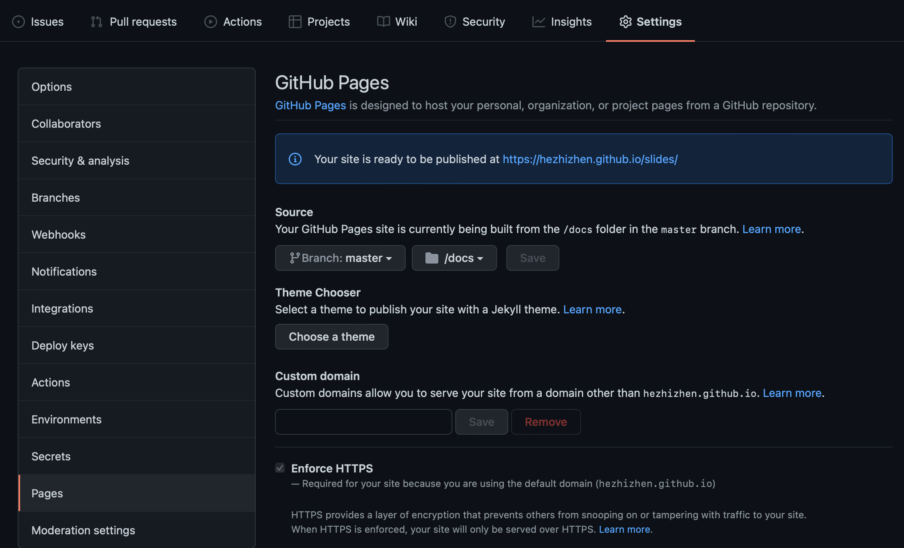
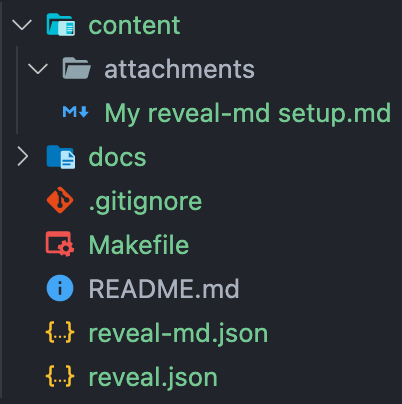
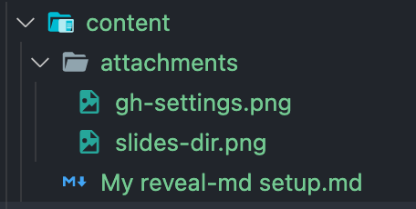
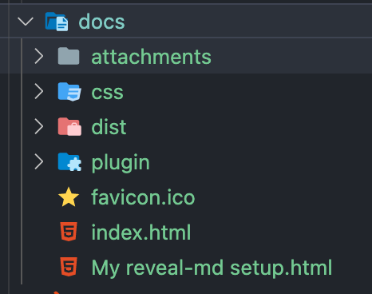
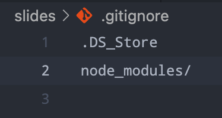
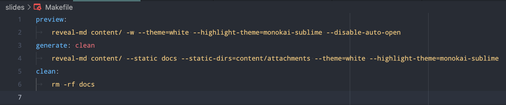
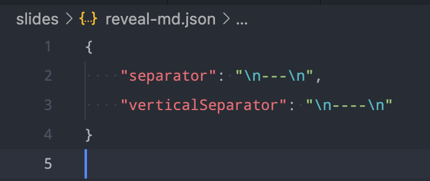
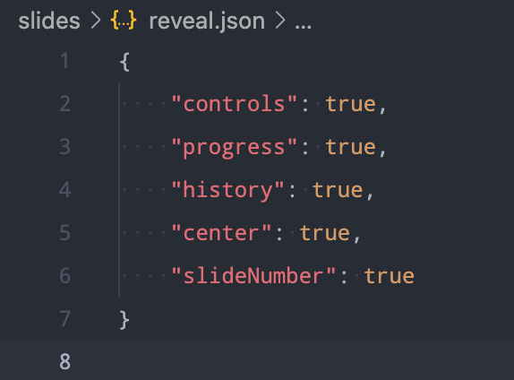

# My reveal-md setup

How to use [reveal-md](https://github.com/webpro/reveal-md) to write presentations in Markdown and host them all on GitHub?

2022-01-14

---

## Prerequisites

* [Markdown](https://www.markdownguide.org)
* [GitHub](https://github.com)
* [reveal.js](https://revealjs.com) (optional)

---

## GitHub

Create a new repository named `slides` with GitHub Pages enabled.

---

## Local

Clone the repository created above and add files and directories to it.

👇
----

### content

This directory is used to store Markdown files.

The `attachments` subdirectory is used to store images, videos, etc.

----

### docs

This directory is used to store generated HTML files, and GitHub will use them to build the site.

----

### gitignore

Nothing special.

----

### Makefile

Just for convenience.

Btw, I prefer `white` theme and `monokai-sublime` highlight theme.

----

### reveal-md.json

Default configurations for reveal-md.

----

### reveal.json

---

## Workflow

1. Create a new Markdown file in `content` and write something (attachments should be added to `attachments`).
2. Execute `make preview` and open [http://localhost:1948](http://localhost:1948) to preview the presentation (modify it if needed).
3. Execute `make generate` and open `docs/index.html` to see the generated HTML.
4. Use `git` commands to push all the changes to GitHub.
5. Wait for a few seconds and then open the [GitHub Page site](https://hezhizhen.github.io/slides) to view the presentation online.

---

## Credits

* KeHan Lu's [Use reveal-md to generate multiple slides and host them on GitHub Page](https://blog.hanklu.tw/post/2021/use-reveal-md-to-generate-multiple-slides-and-host-them-on-github-page/)
* [Themes](https://github.com/hakimel/reveal.js/tree/master/css/theme/source) provided by [reveal.js](https://github.com/hakimel/reveal.js)
* [Highlight styles](https://github.com/highlightjs/highlight.js/tree/main/src/styles) provided by [highlight.js](https://github.com/highlightjs/highlight.js)
