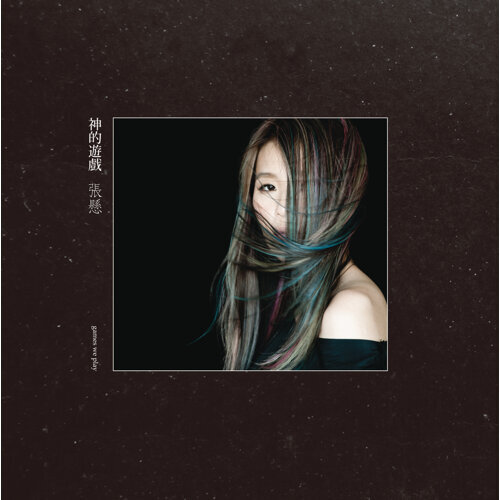

# 我喜爱的歌

今天（2022-01-18）听了[不可理论](https://bukelilun.com)的第 40 期[港乐谈情](https://bukelilun.com/episodes/40)，忽然也很想整理一下自己喜欢的歌和其中中意的字句。无他，唯自娱耳。

---

## The Line-Up

* 陈奕迅
* [Spotify](https://open.spotify.com/album/1YhlJrqnaO8Ks2AwvOuVgE)

----

### 心里有鬼

----

### 我有我爱你

----

### 明年今日

----

### 人来人往

> 爱若能够永不失去
> 何以你今天竟想找寻伴侣

> 闭起双眼我最挂念谁
> 眼睛张开身边竟是谁

> 感激车站里
> 尚有月台曾让我们满足到落泪

> 拥不拥有也会记住谁
> 快不快乐有天总过去

> 爱若难以放进手里
> 何不将这双手放进心里

> 我也开心饮过酒

----

### 季军

----

### 随意门

----

### 1874

----

### 防不胜防

----

### 两名男子街头相遇

----

### 黑面

---

## 神的游戏

* 张悬
* [Spotify](https://open.spotify.com/album/6ZOZeusLIlHMy52JxwsWhY)

----

### 玫瑰色的你

----

### 疯狂的阳光

----

### 蓝天白云

----

### 两者

----

### 如何

----

### 危险的，是

----

### triste

----

### 我想你要走了

----

### 艳火

----

### 日子

---

## EP（单曲）
